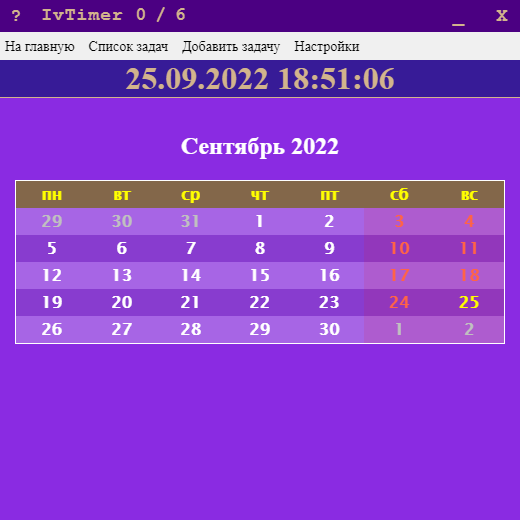
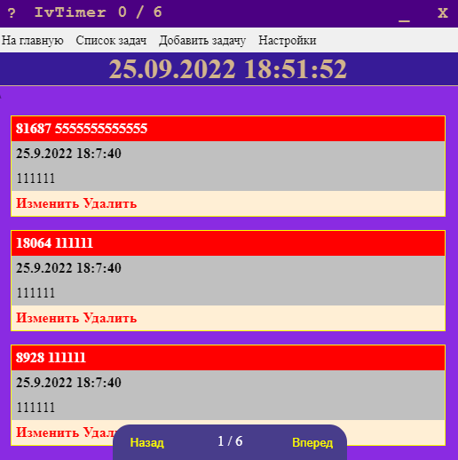

# vue-electron-app

> My vue electron js test

my simple calendar & task list

<div align="center" style="display: flex">
  
  
</div>

#### Build Setup

``` bash
# install dependencies
npm install

# serve with hot reload at localhost:9080
npm run dev

# build electron application for production
npm run build

# run unit tests
npm test


# lint all JS/Vue component files in `src/`
npm run lint

```

---

This project was generated with [electron-vue](https://github.com/SimulatedGREG/electron-vue)@[8d4ed60](https://github.com/SimulatedGREG/electron-vue/tree/8d4ed607d65300381a8f47d97923eb07832b1a9a) using [vue-cli](https://github.com/vuejs/vue-cli). Documentation about the original structure can be found [here](https://simulatedgreg.gitbooks.io/electron-vue/content/index.html).
